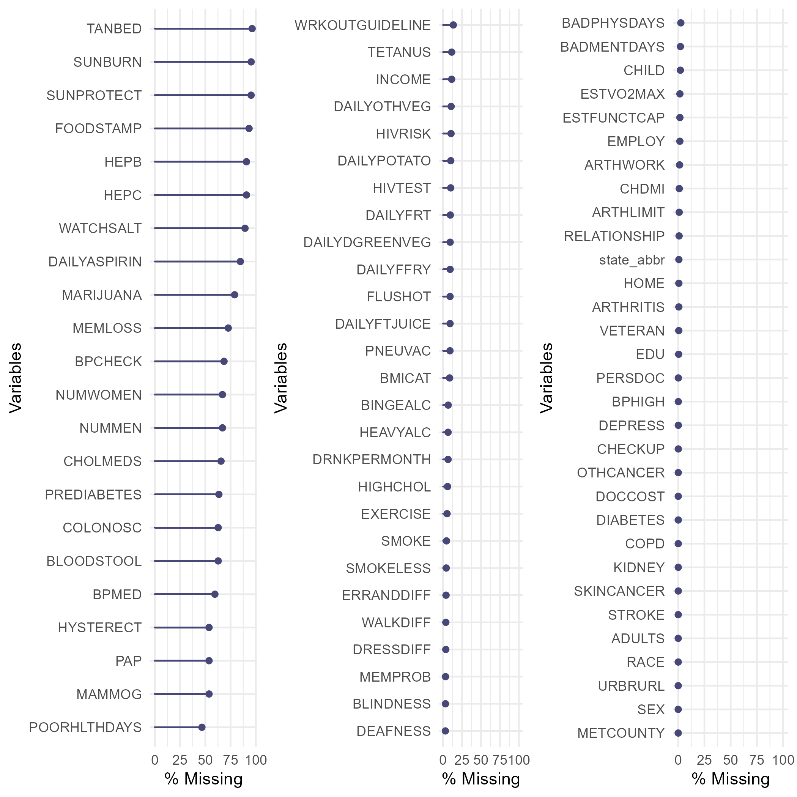
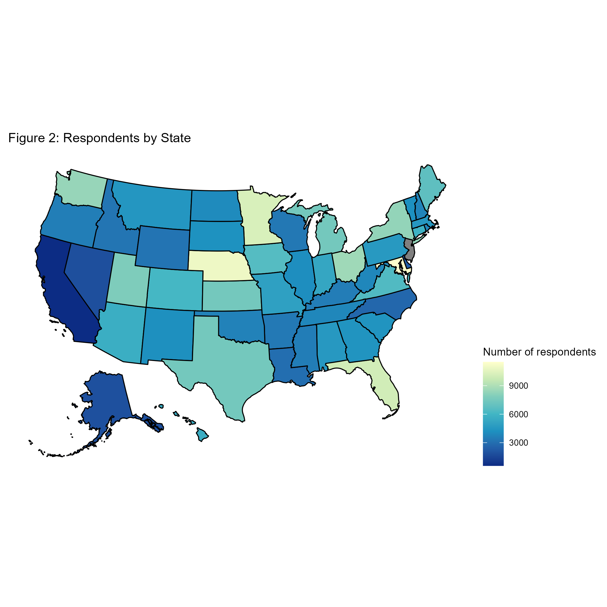
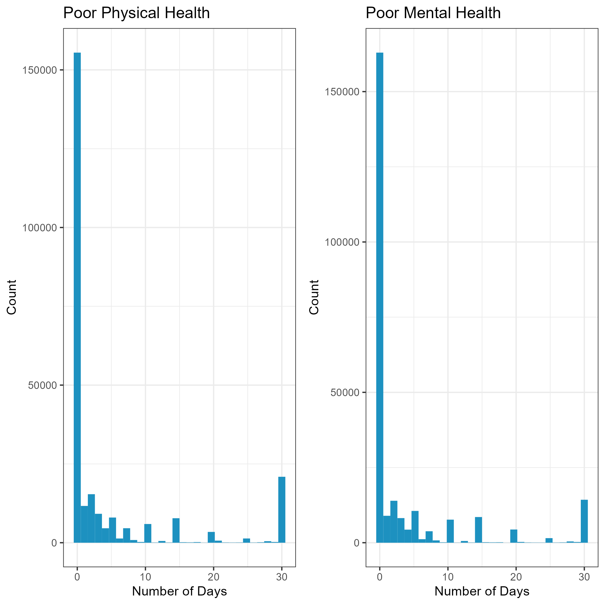

```{r setup, include=FALSE}
knitr::opts_chunk$set(echo = FALSE, results = "hide", warning = FALSE, message = FALSE, fig.width=8, fig.height=4)
options(scipen = 0, digits = 3) 
if(!require('pacman')) {install.packages('pacman')}
pacman::p_load(bestglm, glmnet, leaps, car, tidyverse, pROC, caret, haven, lfactors, readxl, collapse, mice, skimr, naniar, ggpubr, RColorBrewer, usmap, table1, treemap, d3treeR, dplyr, ggbiplot, purrr, tree, rpart, randomForest, ranger, rattle, partykit, ggplot2,lda, data.table, ISLR)
```

```{r load and clean data, eval=FALSE}
data <- read_xpt("data/LLCP2019.XPT")

#Removing unneeded variables
data <- data %>% select(-c(2:16, 18, 21:30, 33, 37, 43, 46, 47, 49, 50, 58:60, 62:63, 67:69, 107, 111, 115:126, 128:130, 132, 134:135, 137:140, 148:150, 153:155, 159, 165:173, 178:179, 185:186, 188:220, 222:223, 225:234, 238:241, 243:250, 255:257, 259, 260, 265:269, 271:274, 276:280, 282:285,  287:288, 294:295, 298:319, 321, 328:335, 338:342))

#Combining mobile and land line number of adults in household, rename variables with leading underscore
data <- data %>%
  mutate(ADULTS = ifelse(is.na(HHADULT), NUMADULT, HHADULT)) %>%
  select(-c("HHADULT", "NUMADULT"))
data <- rename(data, STATE = `_STATE`)
data <- rename(data, MICHD = `_MICHD`)
data <- rename(data, DRDXAR2 = `_DRDXAR2`)
data <- rename(data, LMTACT2 = `_LMTACT2`)
data <- rename(data, LMTWRK2 = `_LMTWRK2`)
data <- rename(data, BMI5CAT = `_BMI5CAT`)
data <- rename(data, SMOKER3 = `_SMOKER3`)
data <- rename(data, DROCDY3 = `DROCDY3_`)
data <- rename(data, RFBING5 = `_RFBING5`)
data <- rename(data, RFDRHV7 = `_RFDRHV7`)
data <- rename(data, TOTINDA = `_TOTINDA`)
data <- rename(data, MAXVO21 = `MAXVO21_`)
data <- rename(data, FC601 = `FC601_`)
data <- rename(data, PAREC2 = `_PAREC2`)
data <- rename(data, FTJUDA2 = `FTJUDA2_`)
data <- rename(data, FRUITDA2 = `FRUTDA2_`)
data <- rename(data, GRENDA1 = `GRENDA1_`)
data <- rename(data, FRNCHDA = `FRNCHDA_`)
data <- rename(data, POTADA1 = `POTADA1_`)
data <- rename(data, VEGEDA2 = `VEGEDA2_`)
data <- rename(data, FRT16A = `_FRT16A`)
data <- rename(data, VEG23A = `_VEG23A`)
data <- rename(data, IMPRACE = `_IMPRACE`)
data <- rename(data, RACEGR3 = `_RACEGR3`)
data <- rename(data, AGE80 = `_AGE80`)
data <- rename(data, METSTAT = `_METSTAT`)
data <- rename(data, URBSTAT = `_URBSTAT`)
data <- rename(data, RFHLTH = `_RFHLTH`)
data <- rename(data, PHYS14D = `_PHYS14D`)
data <- rename(data, MENT14D = `_MENT14D`)
data <- rename(data, HCVU651 = `_HCVU651`)

#Dropping PR and Guam; adding state names
data <- subset(data, STATE != 66 & STATE != 72)
fips <- read_xlsx("data/fips.xlsx")
fips <- select(fips, "state_abbr", "fips")
data <- left_join(data, fips, by = c("STATE" = "fips"))
data <- select(data, -STATE)
rm(fips)

#Creating new variables with different coding, removing old variables
##Note - I started with ifelse statements but switched to case_when because it's easier to read/de-bug, not re-doing previous work
data <- data %>% mutate(SEX = ifelse(SEXVAR == 1, "male", "female"), 
                        BADPHYSDAYS = ifelse(PHYSHLTH==88, 0, ifelse(PHYSHLTH==77 | PHYSHLTH==99, NA, PHYSHLTH)), 
                        BADMENTDAYS = ifelse(MENTHLTH==88, 0, ifelse(MENTHLTH==77 | MENTHLTH==99, NA, MENTHLTH)), 
                        POORHLTHDAYS = ifelse(POORHLTH==88, 0, ifelse(POORHLTH==77 | POORHLTH==99, NA, POORHLTH)), 
                        PERSDOC = ifelse(PERSDOC2==1, "Yes, one", ifelse(PERSDOC2==2, "Yes, more than one", ifelse(PERSDOC2==3, "No", ifelse(PERSDOC2==7, "Not sure", NA)))), 
                        DOCCOST = ifelse(MEDCOST==1, "Yes", ifelse(MEDCOST==2, "No", ifelse(MEDCOST==7, "Not sure", NA))), 
                        CHECKUP = ifelse(CHECKUP1==1, "Past year", ifelse(CHECKUP1==2, "Past 2 years", ifelse(CHECKUP1==3, "Past 5 years", ifelse(CHECKUP1==4, "5 or more years ago", ifelse(CHECKUP1==7, "Not sure", ifelse(CHECKUP1==8, "Never", NA)))))), 
                        BPHIGH = ifelse(BPHIGH4==1, "Yes", ifelse(BPHIGH4==2, "During pregnancy only", ifelse(BPHIGH4==3, "No", ifelse(BPHIGH4==4, "Pre-hypertensive", ifelse(BPHIGH4==7, "Not sure", NA))))), 
                        BPMED = ifelse(BPMEDS==1, "Yes", ifelse(BPMEDS==2, "No", ifelse(BPMEDS==7, "Not sure", ifelse(is.na(BPMEDS), "N/A - normal BP", NA)))), 
                        HIGHCHOL = ifelse(TOLDHI2==1, "Yes", ifelse(TOLDHI2==2, "No", ifelse(TOLDHI2==7, "Not sure",  ifelse(is.na(TOLDHI2), "Never checked", NA)))), 
                        CHOLMEDS = ifelse(CHOLMED2==1, "Yes", ifelse(CHOLMED2==2, "No", ifelse(CHOLMED2==7, "Not sure", ifelse(is.na(CHOLMED2), "N/A - Normal cholesterol", NA)))), 
                        CHDMI = ifelse(MICHD==1, "Yes", ifelse(MICHD==2, "No", NA)), 
                        STROKE = ifelse(CVDSTRK3==1, "Yes", ifelse(CVDSTRK3==2, "No", ifelse(CVDSTRK3==7, "Not sure", NA))), 
                        SKINCANCER = ifelse(CHCSCNCR==1, "Yes", ifelse(CHCSCNCR==2, "No", ifelse(CHCSCNCR==7, "Not sure", NA))), 
                        OTHCANCER = ifelse(CHCOCNCR==1, "Yes", ifelse(CHCOCNCR==2, "No", ifelse(CHCOCNCR==7, "Not sure", NA))), 
                        COPD = ifelse(CHCCOPD2==1, "Yes", ifelse(CHCCOPD2==2, "No", ifelse(CHCCOPD2==7, "Not sure", NA))), 
                        DEPRESS = ifelse(ADDEPEV3==1, "Yes", ifelse(ADDEPEV3==2, "No", ifelse(ADDEPEV3==7, "Not sure", NA))), 
                        KIDNEY = ifelse(CHCKDNY2==1, "Yes", ifelse(CHCKDNY2==2, "No", ifelse(CHCKDNY2==7, "Not sure", NA))), 
                        DIABETES = ifelse(DIABETE4==1, "Yes", ifelse(DIABETE4==2, "Gestational only", ifelse(DIABETE4==3, "No", ifelse(DIABETE4==4, "Pre-diabetes", ifelse(DIABETE4==7, "Not sure", NA))))), 
                        DIABETESYN = ifelse(DIABETE4==1, 1, ifelse(is.na(DIABETE4) | DIABETE4==9, NA, 0)), 
                        ARTHRITIS = ifelse(DRDXAR2==1, "Yes", ifelse(DRDXAR2==2, "No", ifelse(DRDXAR2==7, "Not sure", NA))), 
                        ARTHLIMIT = ifelse(LMTACT2==1, "Limited activities because of arthritis", ifelse(LMTACT2==2, "No limited activities because of arthritis", ifelse(LMTACT2==3, "No arthritis", NA))), 
                        ARTHWORK = ifelse(LMTWRK2==1, "Limited work because of arthritis", ifelse(LMTWRK2==2, "No limited work because of arthritis", ifelse(LMTWRK2==3, "No arthritis", NA))), 
                        RELATIONSHIP = ifelse(MARITAL==1, "Married", ifelse(MARITAL==2, "Divorced", ifelse(MARITAL==3, "Widowed", ifelse(MARITAL==4, "Separated", ifelse(MARITAL==5, "Never married", ifelse(MARITAL==6, "Unmarried partnership", NA)))))), 
                        EDU = ifelse(EDUCA==1, "None", ifelse(EDUCA==2, "Elementary", ifelse(EDUCA==3, "Some high school", ifelse(EDUCA==4, "High school/GED", ifelse(EDUCA==5, "Some college", ifelse(EDUCA==6, "College or more", NA)))))), 
                        HOME = ifelse(RENTHOM1==1, "Own", ifelse(RENTHOM1==2, "Rent", ifelse(RENTHOM1==3, "Other", ifelse(RENTHOM1==7, "Not sure", NA)))), VETERAN = ifelse(VETERAN3==1, "Yes", ifelse(VETERAN3==2, "No", ifelse(VETERAN3==7, "Not sure", NA))), 
                        EMPLOY = ifelse(EMPLOY1==1, "Employed", ifelse(EMPLOY1==2, "Self-employed", ifelse(EMPLOY1==3, "Unemployed 1 year or more", ifelse(EMPLOY1==4, "Unemployed less than 1 year", ifelse(EMPLOY1==5, "Homemaker", ifelse(EMPLOY1==6, "Student", ifelse(EMPLOY1==7, "Retired", ifelse(EMPLOY1==8, "Unable to work", NA)))))))), 
                        CHILD = ifelse(CHILDREN==88, 0, ifelse(CHILDREN==99 | is.na(CHILDREN), NA, CHILDREN)), 
                        INCOME = ifelse(INCOME2==1, "<$10,000", ifelse(INCOME2==2, "$10,000-14,999", ifelse(INCOME2==3, "$15,000-19,999", ifelse(INCOME2==4, "$20,000-24,999", ifelse(INCOME2==5, "$25,000-234,999", ifelse(INCOME2==6, "$35,000-49,999", ifelse(INCOME2==7, "$50,000-74,999", ifelse(INCOME2==8, ">$75,000", ifelse(INCOME2==77, "Not sure", NA))))))))), 
                        BMICAT = ifelse(BMI5CAT==1, "Underweight", ifelse(BMI5CAT==2, "Normal", ifelse(BMI5CAT==3, "Overweight", ifelse(BMI5CAT==4, "Obese", NA)))), 
                        DEAFNESS = ifelse(DEAF==1, "Yes", ifelse(DEAF==2, "No", NA)), 
                        BLINDNESS = ifelse(BLIND==1, "Yes", ifelse(BLIND==2, "No", NA)), 
                        MEMPROB = ifelse(DECIDE==1, "Yes", ifelse(DECIDE==2, "No", ifelse(DECIDE==7, "Not sure", NA))), 
                        WALKDIFF = ifelse(DIFFWALK==1, "Yes", ifelse(DIFFWALK==2, "No", NA)), 
                        DRESSDIFF = ifelse(DIFFDRES==1, "Yes", ifelse(DIFFDRES==2, "No", NA)), 
                        ERRANDDIFF = ifelse(DIFFALON==1, "Yes", ifelse(DIFFALON==2, "No", NA)), 
                        SMOKE = ifelse(SMOKER3==1, "Currently smoke every day", ifelse(SMOKER3==2, "Currently smokes some days", ifelse(SMOKER3==3, "Former smoker", ifelse(SMOKER3==4, "Never smoked", NA)))), 
                        SMOKELESS = ifelse(USENOW3==1, "Every day", ifelse(USENOW3==2, "Some days", ifelse(USENOW3==3, "Never", NA))), 
                        BINGEALC = ifelse(RFBING5==1, "No", ifelse(RFBING5==2, "Yes", NA)), 
                        HEAVYALC = ifelse(RFDRHV7==1, "No", ifelse(RFDRHV7==2, "Yes", NA)), 
                        EXERCISE = ifelse(TOTINDA==1, "Yes", ifelse(TOTINDA==2, "No", NA)), 
                        WRKOUTGUIDELINE = ifelse(PAREC2==1, "Strength and aerobic guidelines met", ifelse(PAREC2==2, "Aerobic guidelines met", ifelse(PAREC2==3, "Strength guidelines met", ifelse(PAREC2==4, "Neither guideline met", NA)))),
                        ESTVO2MAX = ifelse(MAXVO21==99900, NA, MAXVO21/100), #Codebook says "(two implied decimal places)" -                                                                                applies through DAILYOTHVEG
                        ESTFUNCTCAP = ifelse(FC601==99900, NA, FC601/100),
                        DAILYFTJUICE = FTJUDA2/100,
                        DAILYDGREENVEG = GRENDA1/100,
                        DAILYFFRY = FRNCHDA/100,
                        DAILYPOTATO = POTADA1/100,
                        DAILYFRT = ifelse(FRT16A==1, FRUITDA2/100, NA),
                        DAILYOTHVEG = ifelse(VEG23A==1, VEGEDA2/100, NA), 
                        FLUSHOT = case_when(FLUSHOT7==1 ~ "Yes",
                                            FLUSHOT7==2 ~ "No",
                                            FLUSHOT7==3 ~ "Not sure",
                                            TRUE ~ NA_character_),
                        TETANUS = case_when(TETANUS1==1 ~ "Yes, Tdap",
                                            TETANUS1==2 ~ "Yes, not Tdap",
                                            TETANUS1==3 ~ "Yes, not sure which type",
                                            TETANUS1==4 ~ "No",
                                            TETANUS1==7 ~ "Not sure",
                                            TRUE ~ NA_character_),
                        PNEUVAC = case_when(PNEUVAC4==1 ~ "Yes",
                                            PNEUVAC4==2 ~ "No",
                                            PNEUVAC4==7 ~ "Not sure",
                                            TRUE ~ NA_character_),
                        HIVTEST = case_when(HIVTST7==1 ~ "Yes",
                                            HIVTST7==2 ~ "No",
                                            HIVTST7==7 ~ "Not sure",
                                            TRUE ~ NA_character_),
                        HIVRISK = case_when(HIVRISK5==1 ~ "Yes",
                                            HIVRISK5==2 ~ "No",
                                            HIVRISK5==7 ~ "Not sure",
                                            TRUE ~ NA_character_),
                        PREDIABETES = case_when(PREDIAB1==1 ~ "Yes",
                                                PREDIAB1==2 ~ "During pregnancy",
                                                PREDIAB1==3 ~ "No",
                                                PREDIAB1==7 ~ "Not sure",
                                                TRUE ~ NA_character_),
                        HEPC = case_when(TOLDHEPC==1 ~ "Yes",
                                         TOLDHEPC==2 ~ "No",
                                         TOLDHEPC==7 ~ "Not sure",
                                         TRUE ~ NA_character_),
                        HEPB = case_when(HAVEHEPB==1 ~ "Yes",
                                         HAVEHEPB==2 ~ "No",
                                         HAVEHEPB==7 ~ "Not sure",
                                         TRUE ~ NA_character_),
                        MAMMOG = case_when(SEXVAR==1 & is.na(HADMAM) ~ "N/A - male",
                                           HADMAM==1 ~ "Yes",
                                           HADMAM==2 ~ "No",
                                           HADMAM==7 ~ "Not sure",
                                           TRUE ~ NA_character_),
                        PAP = case_when(SEXVAR==1 & is.na(HADPAP2) ~ "N/A - male",
                                        HADPAP2==1 ~ "Yes",
                                        HADPAP2==2 ~ "No",
                                        HADPAP2==7 ~ "Not sure",
                                        TRUE ~ NA_character_),
                        HPVTEST = case_when(SEXVAR==1 & is.na(HPVTEST) ~ "N/A - male",
                                        HPVTEST==1 ~ "Yes",
                                        HPVTEST==2 ~ "No",
                                        HPVTEST==7 ~ "Not sure",
                                        TRUE ~ NA_character_),
                        HYSTERECT = case_when(SEXVAR==1 & is.na(HADHYST2) ~ "N/A - male",
                                        HADHYST2==1 ~ "Yes",
                                        HADHYST2==2 ~ "No",
                                        HADHYST2==7 ~ "Not sure",
                                        TRUE ~ NA_character_),
                        BLOODSTOOL = case_when(AGE80<50 & is.na(BLDSTOOL) ~ "N/A - under 50",
                                        BLDSTOOL==1 ~ "Yes",
                                        BLDSTOOL==2 ~ "No",
                                        BLDSTOOL==7 ~ "Not sure",
                                        TRUE ~ NA_character_),
                        RACE = case_when(RACEGR3==1 ~ "White, non-Hispanic",
                                         RACEGR3==2 ~ "Black, non-Hispanic",
                                         RACEGR3==3 ~ "Other, non-Hispanic",
                                         RACEGR3==4 ~ "Multiracial, non-Hispanic",
                                         RACEGR3==5 ~ "Hispanic",
                                         RACEGR3==9 ~ "Not sure/refused",
                                         TRUE ~ NA_character_),
                        COLONOSC = case_when(AGE80<50 & is.na(HADSIGM3) ~ "N/A - under 50",
                                        HADSIGM3==1 ~ "Yes",
                                        HADSIGM3==2 ~ "No",
                                        HADSIGM3==7 ~ "Not sure",
                                        TRUE ~ NA_character_),
                        DAILYASPIRIN = case_when(ASPIRIN==1 ~ "Daily",
                                                 ASPIRIN==2 ~ "Some days",
                                                 ASPIRIN==3 ~ "Used to, stopped from side effects",
                                                 ASPIRIN==4 ~ "No",
                                                 ASPIRIN==7 ~ "Not sure",
                                                 TRUE ~ NA_character_),
                        BPCHECK = case_when(HOMRGCHK==1 ~ "Yes",
                                            HOMRGCHK==2 ~ "No",
                                            HOMRGCHK==7 ~ "Not sure",
                                            TRUE ~ NA_character_),
                        WATCHSALT = case_when(WTCHSALT==1 ~ "Yes",
                                              WTCHSALT==2 ~ "No",
                                              WTCHSALT==7 ~ "Not sure",
                                              TRUE ~ NA_character_),
                        TANBED = ifelse(INDORTAN==999, NA, INDORTAN),
                        SUNBURN = ifelse(NUMBURN3==999 | NUMBURN3==777, NA, NUMBURN3),
                        SUNPROTECT = case_when(SUNPRTCT==1 ~ "Always",
                                               SUNPRTCT==2 ~ "Most of the time",
                                               SUNPRTCT==3 ~ "Sometimes",
                                               SUNPRTCT==4 ~ "Rarely",
                                               SUNPRTCT==5 ~ "Never",
                                               SUNPRTCT==6 ~ "Don't stay outside more than 1 hour on sunny days",
                                               SUNPRTCT==7 ~ "Not sure",
                                               SUNPRTCT==8 ~ "Don't go outside on sunny days",
                                               TRUE ~ NA_character_),
                        MEMLOSS = case_when(CIMEMLOS==1 ~ "Yes",
                                            CIMEMLOS==2 ~ "No",
                                            CIMEMLOS==7 ~ "Not sure",
                                            TRUE ~ NA_character_),
                        MARIJUANA = ifelse(MARIJAN1==88, 0, ifelse(MARIJAN1==77 | MARIJAN1==99 | is.na(MARIJAN1), NA,         MARIJAN1)), 
                        FOODSTAMP = case_when(FOODSTMP==1 ~ "Yes",
                                              FOODSTMP==2 ~ "No",
                                              FOODSTMP==7 ~ "Not sure",
                                              TRUE ~ NA_character_),
                        METCOUNTY = case_when(METSTAT==1 ~ "Metropolitan",
                                               METSTAT==2 ~ "Not metropolitan",
                                               TRUE ~ NA_character_),
                        URBRURL = case_when(URBSTAT==1 ~ "Urban",
                                            URBSTAT==2 ~ "Rural",
                                            TRUE ~ NA_character_)
                          ) %>%
  select(-c(SEXVAR, PHYSHLTH, MENTHLTH, POORHLTH, PERSDOC2, MEDCOST, CHECKUP1, BPHIGH4, BPMEDS, TOLDHI2, CHOLMED2, MICHD, CVDSTRK3, CHCSCNCR, CHCOCNCR, CHCCOPD2, ADDEPEV3, CHCKDNY2, DIABETE4, DIABAGE3, LMTACT2, LMTWRK2, MARITAL, EDUCA, RENTHOM1, VETERAN3, EMPLOY1, CHILDREN, INCOME2, BMI5CAT, PREGNANT, DEAF, BLIND, DECIDE, DIFFWALK, DIFFDRES, DIFFALON, SMOKE100, SMOKDAY2, SMOKER3, STOPSMK2, LASTSMK2, USENOW3, DROCDY3, MAXDRNKS, RFBING5, RFDRHV7, TOTINDA, EXERANY2, EXRACT11, EXRACT21, EXEROFT1, EXEROFT2, EXERHMM1, EXERHMM2, STRENGTH, PAREC2, FRUIT2, FRUITJU2, FVGREEN1, FRENCHF1, POTATOE1, VEGETAB2, LMTJOIN3, WEIGHT2, HEIGHT3, VEG23A, FRT16A, VEGEDA2, FLUSHOT7, TETANUS1, PNEUVAC4, HIVTST7, HIVRISK5, PDIABTST, PREDIAB1, TOLDHEPC, HAVEHEPB, HPVADVC3, SHINGLE2, HADMAM, HOWLONG, HADPAP2, LASTPAP2, HPVTEST, HPLSTTST, PSATEST1, PSATIME, IMPRACE, LSTBLDS3, HADSIGM3, BLDSTOOL, LASTSIG3, CNCRDIFF, CNCRAGE, CNCRTYP1, CSRVTRT3, HLTHCVR1, ASPIRIN, HOMBPCHK, HOMRGCHK, WTCHSALT, DRADVISE, NUMBURN3, SUNPRTCT, CIMEMLOS, MARIJAN1, FOODSTMP, METSTAT, URBSTAT, MSCODE, RFHLTH, PHYS14D, MENT14D, HCVU651))

#Calculating alcohol use
data <- data %>% mutate(DAYSDRINK = case_when(ALCDAY5==888 ~ 0,
                                              ALCDAY5==777 | ALCDAY5==999 ~ NA_real_,
                                              ALCDAY5<200 ~ round((ALCDAY5-100)*4.29, 0),
                                              ALCDAY5>200 ~ ALCDAY5-200,
                                              TRUE ~ NA_real_),
                        DRNKPERDAY = case_when(is.na(AVEDRNK3) & DAYSDRINK==0 ~ 0,
                                               is.na(AVEDRNK3) & DAYSDRINK!=0 ~ NA_real_, 
                                               AVEDRNK3==77 | AVEDRNK3==99 | is.na(AVEDRNK3) ~ NA_real_,
                                               TRUE ~ AVEDRNK3),
                        DRNKPERMONTH = DAYSDRINK*DRNKPERDAY)

#Final removal of unneeded variables, rearranging variable order
data <- data %>%
  select(-c(3:19, 98, 99)) %>% 
  relocate(DIABETESYN)

#Changing character variables to factor
data <- data %>% mutate(across(5:6, as.factor)) %>% mutate(across(10:32, as.factor)) %>% mutate(across(34:47, as.factor)) %>% mutate(across(56:81, as.factor))

#Save data file
write.csv(data, file = "cleaneddata_4.11.23.csv", row.names = FALSE)

```

```{r load cleaned data, eval=FALSE}
data <- read.csv("data/cleaneddata_4.11.23.csv")
```

```{r assessing missingness, eval=FALSE}
#Generating missingness graphic - original version has too many variables and can't be read. Breaking into 3 groups then faceting.
missing <- miss_var_summary(data)
missing_high <- filter(missing, pct_miss>15)
vars_high <- missing_high$variable
missing_med <- filter(missing, pct_miss>3 & pct_miss<15)
vars_med <- missing_med$variable
missing_low <- filter(missing, pct_miss<3)
vars_low <- missing_low$variable

data_misshigh <- data %>% select(all_of(vars_high))
data_missmed <- data %>% select(all_of(vars_med))
data_misslow <- data %>% select(all_of(vars_low))

fig1a <- gg_miss_var(data_misshigh, show_pct = TRUE)
fig1b <- gg_miss_var(data_missmed, show_pct = TRUE) + ylim(0, 100)
fig1c <- gg_miss_var(data_misslow, show_pct = TRUE) + ylim(0, 100)
figure1 <- ggarrange(fig1a, fig1b, fig1c, ncol = 3, nrow = 1)
ggsave("figure1.png", plot = figure1)

#There is a fairly large jump in missingness (from 13.5% to 46.6%) in the table. Removing all variables with more than 13.5% missingness.
data <- data %>% select(-c(TANBED, SUNBURN, SUNPROTECT, FOODSTAMP, HEPB, HEPC, WATCHSALT, DAILYASPIRIN, DIABETES, MARIJUANA, MEMLOSS, BPCHECK, NUMWOMEN, NUMMEN, CHOLMEDS, PREDIABETES, COLONOSC, BLOODSTOOL, BPMED, HYSTERECT, PAP, MAMMOG, POORHLTHDAYS)) %>%
  drop_na(DIABETESYN)

miss_var_summary(data)
```

```{r single imputation, eval=FALSE}
##Below code adapted from Aycan Katitis (https://data.library.virginia.edu/getting-started-with-multiple-imputation-in-r/) 

# Run the mice code with 0 iterations 
imp <- mice(data, maxit=0)

# Extract predictorMatrix and methods of imputation 
predM <- imp$predictorMatrix
meth <- imp$method

# Setting values of variables I'd like to leave out to 0 in the predictor matrix
predM[, c("state_abbr")] <- 0
predM[, c("SEX")] <- 0
predM[, c("PERSDOC")] <- 0
predM[, c("DOCCOST")] <- 0
predM[, c("CHECKUP")] <- 0
predM[, c("BPHIGH")] <- 0
predM[, c("HIGHCHOL")] <- 0
predM[, c("CHDMI")] <- 0
predM[, c("STROKE")] <- 0
predM[, c("SKINCANCER")] <- 0
predM[, c("OTHCANCER")] <- 0
predM[, c("COPD")] <- 0
predM[, c("DEPRESS")] <- 0
predM[, c("KIDNEY")] <- 0
predM[, c("ARTHRITIS")] <- 0
predM[, c("ARTHLIMIT")] <- 0
predM[, c("ARTHWORK")] <- 0
predM[, c("RELATIONSHIP")] <- 0
predM[, c("EDU")] <- 0
predM[, c("HOME")] <- 0
predM[, c("VETERAN")] <- 0
predM[, c("EMPLOY")] <- 0
predM[, c("INCOME")] <- 0
predM[, c("BMICAT")] <- 0
predM[, c("DEAFNESS")] <- 0
predM[, c("BLINDNESS")] <- 0
predM[, c("MEMPROB")] <- 0
predM[, c("WALKDIFF")] <- 0
predM[, c("DRESSDIFF")] <- 0
predM[, c("ERRANDDIFF")] <- 0
predM[, c("SMOKE")] <- 0
predM[, c("SMOKELESS")] <- 0
predM[, c("BINGEALC")] <- 0
predM[, c("HEAVYALC")] <- 0
predM[, c("EXERCISE")] <- 0
predM[, c("WRKOUTGUIDELINE")] <- 0
predM[, c("FLUSHOT")] <- 0
predM[, c("TETANUS")] <- 0
predM[, c("PNEUVAC")] <- 0
predM[, c("HIVTEST")] <- 0
predM[, c("HIVRISK")] <- 0
predM[, c("RACE")] <- 0
predM[, c("METCOUNTY")] <- 0
predM[, c("URBRURL")] <- 0

#Running single imputation
imp2 <- mice(data, maxit = 1,
             seed = 123,
             predictorMatrix = predM, 
             method = meth, print =  FALSE)

data_complete <- mice::complete(imp2, 1)

data_final <- data_complete %>% filter(complete.cases(data_complete))

miss_var_summary(data_final)

#Saving final analysis dataset
write.csv(data_final, file = "finaldataset.csv", row.names = FALSE)
```

```{r load final dataset}
diabetes <- read.csv("finaldataset.csv")

diabetes <- diabetes %>% mutate(across(3:4, as.factor)) %>% mutate(across(7:26, as.factor)) %>% mutate(across(28:41, as.factor)) %>% mutate(across(50:57, as.factor))
diabetes$DIABETESYN <- as.factor(diabetes$DIABETESYN)
# diabetes <- readRDS("diabetes.rds")
```
# Executive Summary


# Background
There are approximately 37.3 million individuals in the US living with diabetes, which represents 11.3% of the population. It is estimated that around 8.5 million of these individuals remain undiagnosed, meaning that 23% of adults living with diabetes are unaware of their health status (1). Diabetes is associated with significant morbidity and mortality, with diabetic individuals at risk of additional health conditions including chronic kidney disease, heart disease, nerve damage, vision loss, and difficulties with wound healing (2). Studies have estimated that diabetes may be present in an individual 4-7 years before the onset of clinical signs, highlighting the importance of routine screening even when patients remain asymptomatic (3-5). This is especially important given that clinical outcomes are improved with early intervention (6). Unfortunately, a high proportion of US adults do not attend routine health screenings, with one study finding that only 46.2% of individuals who met American Diabetes Association screening criteria had received diabetes screening (7). Prior studies have identified numerous barriers to health screenings, including lack of knowledge of the condition, fear, and lack of access to screening services (8). It could therefore be beneficial to create a non-invasive, survey-based questionnaire that can be completed by a patient at home which would identify their likelihood of having diabetes. Such a tool could eliminate some barriers to screening access by improving convenience as well as eliminate some of the fear associated with attending screening procedures in a clinical setting. Individuals who are likely to have diabetes based on the survey results would be prompted to receive screening and provided with resources and information to help encourage completion of screening. 

In this study, we sought to use existing health survey data from the CDC's Behavioral Risk Factor Surveillance System (BRFSS) to create a model which would predict whether an individual has diabetes with a high level of accuracy.

# Methods
## Data Cleaning
Data for this project was obtained from the CDC's 2019 BRFSS. The BRFSS is a national telephone-based survey which is conducted in all 50 states plus Puerto Rico and Guam, and collects information from US adults regarding health risk factors, medical conditions, and use of preventive services. For this project, we elected to use data from the 2019 survey given concern that the wide-reaching impact of the COVID-19 pandemic on health and socioeconomic factors would influence the analysis. 

The complete 2019 BRFSS file was downloaded from the CDC's website. The original file included 342 variables and 418,268 observations. First, we selected variables which could plausibly be used to predict the presence of diabetes. We then eliminated responses from individuals living in Puerto Rico or Guam to limit our analysis to US states only. Categorical variables were re-coded from numeric to character for ease of interpretation. The BRFSS survey includes many questions with skip logic; for example, if a respondent reports being of the male sex, they will not be asked about Pap smear or mammography history. Within the dataset, these values as coded as missing; we therefore generated new variables which included "not applicable" as an option to distinguish these values from true missing values. Finally, we generated a new variable for drinks of alcohol per month based on respondents' stated drinking instances per week/month and average number of drinks per instance.

Because different survey modules are used in different states, some variables exhibited a high rate of missingness. For example, as can be seen in **Figure 1**, greater than 90% of participants are missing responses for questions relating to skin cancer risk, food stamp use, and diagnosis with hepatitis B or C. 
<center>

{width=75%}

</center>
</br>
To help mitigate the missing data problem, all variables with more than 13.5% missingness were removed (N = 23). For the remaining variables (N = 58), all numeric variables with missing data were imputed using single imputation. Finally, all remaining rows with missing values were removed.

## Analysis
First, the data was examined descriptively. Next, principal component analysis (PCA) was performed using the six numeric variables which describe daily diet. Based on an assessment of scree plots of variances and the proportion of variance explained (PVE), it was determined that an assessment using four leading principal components (PCs) would be sufficient. Principal components were visually examined through the generation of biplots and the PCs were further explored through interpretation of the loadings. K-means clustering was then performed using the 12 numeric variables in the dataset. We first performed PCA and used 8 PCs for further analysis based on the summary table and the scree plot of PVE. To determine the number of clusters, we calculated the total within-cluster sum of square (WSS).

# Results
## Descriptive Statistics
```{r descriptive figures, eval=FALSE}
#State distribution map
states <- diabetes %>% group_by(state_abbr) %>%
  summarise(total_count=n(),.groups = 'drop') %>%
  rename(state = state_abbr)
states$state_abbr <- state.name[match(states$state_abbr, state.abb)]

figure2 <- plot_usmap(regions = "state",
    data = states, 
    values = "total_count", color = "black") + 
    scale_fill_distiller(palette = "YlGnBu", name = "Number of respondents") + 
    labs(title = "Figure 2: Respondents by State") +
    theme(legend.position = "right")
ggsave("figure2.png", plot = figure2)

#Race and sex barplot
figure3 <- ggplot(diabetes, aes(x = RACE, fill = SEX)) +
  geom_bar() +
  scale_x_discrete(labels = function(x) str_wrap(x, width = 10)) +
  labs(title = "Figure 3: Race and Sex of Respondents", y="Count", x="Race") + 
  scale_fill_brewer(palette="Pastel1") + 
  theme_bw()
ggsave("figure3.png", plot = figure3)

#Bad physical and mental health days histograms
figure4a <- ggplot(diabetes) +
  geom_histogram(aes(x=BADPHYSDAYS), fill="#1d91c0") +
  labs(title = "Poor Physical Health", y="Count", x="Number of Days") +
  theme_bw()
figure4b <- ggplot(diabetes) +
  geom_histogram(aes(x=BADMENTDAYS), fill="#1d91c0") + 
  labs(title = "Poor Mental Health", y="Count", x="Number of Days") +
  theme_bw()
figure4 <- ggarrange(figure4a, figure4b)
ggsave("figure4.png", plot = figure4)
```
The final analytic dataset includes 58 variables with 253,684 observations and no missing data. **Figure 2** provides a density map of the number of respondents per state - it is evident that the respondent distribution does not match the US population, as California has relatively few respondents whereas Nebraska has very many. The BRFSS data includes weighting variables which can be used to ensure the responses are representative of the US population, which is necessary to draw many epidemiological conclusions. However, as our goal is prediction, it is not necessary to employ the survey weights.
<center>

{width=75%}

</center>
**Figure 3** shows the distribution of respondent race and ethnicity by sex. The majority of the study population is non-Hispanic white, and there are generally equal numbers of males and females. Survey participants were asked about their overall physical and mental health, reporting the number of days within the past 30 that they experienced poor mental or physical health. In Figure 4, we can see that most participants felt that they experienced 0 to few poor mental or physical health days in the past month, with a subset of participants reporting poor health in all of the past 30 days.
<center>

{width=75%}

</center>
<center>

{width=75%}

</center>
The interactive treemap in **Figure 5** shows the relative number of respondents in each education category. Information on employment status and housing status can be explored within each education level by clicking on the respective rectangle. The majority of respondents completed at least some college. There appears to be a correlation between level of education and employment status, with individuals who attained higher levels of education being less likely to be unemployed than individuals who attained lower levels of education. Similarly, individuals who are employed or retired are more likely to own their home than individuals who are unemployed.
```{r treemap, fig.show='hide'}
#Treemap of education, employment, and home ownership
edudata <- diabetes %>%
  mutate(EMPLOY2 = ifelse(EMPLOY=="Unable to work" | EMPLOY=="Unemployed 1 year or more" | EMPLOY=="Unemployed less than 1 year", "Unemployed", EMPLOY), HOME2 = ifelse(HOME=="Other" | HOME=="Not sure", "Other", HOME), EDU2 = ifelse(EDU=="Elementary" | EDU=="None" | EDU=="Some high school", "Less than high school", EDU)) %>%
  group_by(EDU2, EMPLOY2, HOME2) %>%
  dplyr::summarise(total=n(),.groups = 'drop') %>%
  ungroup()
figure5 <- treemap(edudata, index=c("EDU2", "EMPLOY2", "HOME2"), vSize = "total", type = "index", palette="YlGnBu")
figure5_inter <- d3tree2(figure5,  rootname = "Education Level" )
```
**Figure 5:** Interactive treemap of housing status by employment status and education level
```{r ubteractive treemap, results='markup'}
figure5_inter
```


Finally, we examine the distribution of characteristics by presence of diabetes, the outcome that we aim to predict (**Table 1**). Many of the selected variables are significantly different at the 0.05 level between the diabetic and non-diabetic groups. Individuals with diabetes are more likely to be Black or Hispanic, unemployed/unable to work, attain lower levels of education, have other co-morbid conditions such as high blood pressure and obesity, and eat fewer servings of fruits and vegetables.
```{r table 1, results='markup'}
#Function to perform t-tests and chi-square tests for Table 1 variables
pvalue <- function(x, ...) {
    # Construct vectors of data y, and groups (strata) g
    y <- unlist(x)
    g <- factor(rep(1:length(x), times=sapply(x, length)))
    if (is.numeric(y)) {
        # For numeric variables, perform a standard 2-sample t-test
        p <- t.test(y ~ g)$p.value
    } else {
        # For categorical variables, perform a chi-squared test of independence
        p <- chisq.test(table(y, g))$p.value
    }
    # Format the p-value, using an HTML entity for the less-than sign.
    # The initial empty string places the output on the line below the variable label.
    c("", sub("<", "&lt;", format.pval(p, digits=3, eps=0.001)))
}

#Labels
label(diabetes$RACE) <- "Race"
label(diabetes$SEX) <- "Sex"
label(diabetes$EDU) <- "Education"
label(diabetes$HOME) <- "Living Arrangement"
label(diabetes$EMPLOY) <- "Employment Status"
label(diabetes$CHECKUP) <- "Timing of Most Recent Health Check-up"
label(diabetes$BPHIGH) <- "High Blood Pressure"
label(diabetes$DEPRESS) <- "Depression"
label(diabetes$BMICAT) <- "BMI Category"
label(diabetes$WRKOUTGUIDELINE) <- "Workout Recommendations Met"
label(diabetes$DAILYDGREENVEG) <- "Daily Servings of Dark Green Vegetables"
label(diabetes$DAILYOTHVEG) <- "Daily Servings of Other Vegetables"
label(diabetes$DAILYFRT) <- "Daily Servings of Fruit"
label(diabetes$DAILYFFRY) <- "Daily Servings of French Fries"
label(diabetes$DAILYPOTATO) <- "Daily Servings of Potatoes"
label(diabetes$DRNKPERMONTH) <- "Number of Alcoholic Drinks per Month"
diabetes$DIABETESYN <- factor(diabetes$DIABETESYN, levels=c(1,0), labels=c("Diabetes", "No Diabetes"))

#Creation of traditional "Table 1" with selected variables.
table1 <- table1(~ SEX + RACE + EDU + HOME + EMPLOY + CHECKUP + BPHIGH + DEPRESS + BMICAT + WRKOUTGUIDELINE + DAILYDGREENVEG + DAILYOTHVEG + DAILYFRT + DAILYFFRY + DAILYPOTATO + DRNKPERMONTH | factor(DIABETESYN), data = diabetes, overall = F, extra.col=list(`P-value`=pvalue), caption = "Table 1: Selected descriptive statistics of the study population by diabetes diagnosis.")

table1
```

## Principal Component Analysis
For the principal component analysis, we focus on six numeric variables measuring the daily diet.
\par
- `DAILYFTJUICE`: Daily servings of juice
- `DAILYDGREENVEG`: Daily servings of dark green vegetables
- `DAILYFFRY`: Daily servings of French fries
- `DAILYPOTATO`: Daily servings of potatoes
- `DAILYFRT`: Daily servings of fruit
- `DAILYOTHVEG`: Daily servings of other vegetables

```{r select numeric variables for pca, echo=FALSE,results='hide',message=FALSE}
# numeric variables
data_pca <- diabetes[, -1] #do not need diabetes label

var_daily <- data_pca %>%
  select_if(is.numeric) %>%
  dplyr::select(starts_with("DAILY")) #select variables related to daily diet
```

\par
**Table 2.1** shows the loadings of all six PCs. We can observe the PVE and cumulative PVE from **Figure 6.1**, **Figure 6.2** and **Table 2.2**. The scree plots of variances and PVE indicate that the four leading PCs should be sufficient. We further explore the interpretations of loadings and PCs:
\begin{align*}
PC_1 = 0.291 \times DAILYFTJUICE + 0.530 \times DAILYDGREENVEG + 0.275 \times DAILYFFRY \\ + 0.384 \times DAILYPOTATO + 0.320 \times DAILYFRT + 0.555 \times DAILYOTHVEG \\
PC_2 = -0.005 \times DAILYFTJUICE + 0.243 \times DAILYDGREENVEG -0.671 \times DAILYFFRY \\ -0.534 \times DAILYPOTATO + 0.375 \times DAILYFRT + 0.256 \times DAILYOTHVEG \\
PC_3 = 0.770 \times DAILYFTJUICE -0.340 \times DAILYDGREENVEG + 0.002 \times DAILYFFRY \\ -0.012 \times DAILYPOTATO + 0.434 \times DAILYFRT -0.321 \times DAILYOTHVEG \\
PC_4 = -0.562 \times DAILYFTJUICE -0.285 \times DAILYDGREENVEG + 0.176 \times DAILYFFRY \\ + 0.150 \times DAILYPOTATO + 0.739 \times DAILYFRT -0.051 \times DAILYOTHVEG \\
\end{align*}
\par
- $PC_1$: $PC_1$ is approximately proportional to the total of the six daily diet intake variables (`DAILYFTJUICE`, `DAILYFFRY`, `DAILYPOTATO`, `DAILYDGREENVEG`, `DAILYFRT`, and `DAILYOTHVEG)`, indicating that higher values of $PC_1$ correspond to a higher total daily diet intake. Therefore, $PC_1$ can be interpreted as measuring overall diet intake.
- $PC_2$: The sign of the loadings is negative for `DAILYFTJUICE`, `DAILYFFRY`, and `DAILYPOTATO`, indicating that a higher intake of these foods is associated with a less healthy diet. Conversely, the sign of the loadings is positive for `DAILYDGREENVEG`, `DAILYFRT`, and `DAILYOTHVEG`, indicating that a higher intake of these foods is associated with a healthier diet. Therefore, $PC_2$ can be interpreted as measuring the difference between the intake of healthy and less healthy foods."
- $PC_3$: The sign of the loadings is positive for `DAILYFTJUICE` and `DAILYFRT`, indicating that higher intake of these foods is associated with $PC_3$. Conversely, the sign of the loadings is negative for `DAILYDGREENVEG`, `DAILYPOTATO`, and `DAILYOTHVEG`, indicating that a higher intake of these foods is associated with lower values of $PC_3$. Therefore, $PC_3$ represents the difference between the intake of fruits and the intake of vegetables. Since the loading for `DAILYFFRY` is only 0.002, we can ignore this variable in $PC_3$.
- $PC_4$: The sign of the loadings is positive for `DAILYFFRY`, `DAILYPOTATO` and `DAILYFRT`, while the sign is negative for `DAILYFTJUICE`, `DAILYDGREENVEG` and `DAILYOTHVEG`. While there is no direct interpretation for $PC_4$ compared to other PCs, some studies suggest that fruit and fruit juice can affect blood sugar levels. Therefore, we hypothesize that $PC_4$ represents the difference between a diet higher in fructose and carbon, and a diet higher in sugar and fiber.

```{r find PCs and loadings, echo=FALSE,results='asis',message=FALSE}
pc_daily <- prcomp(var_daily, scale=TRUE)
pc_loading <- pc_daily$rotation
knitr::kable(pc_loading, caption = "Table 2.1: Summary table of PCs and loadings")
```


```{r scree plot of PVE, results='hide',message=FALSE,fig.align = 'center'}
# scree plot of PVE 
plot(summary(pc_daily)$importance[2, ],
     ylab="PVE",
     xlab="Number of PCs",
     pch = 16,
     main="Figure 6.1: Scree Plot of PVE")
```

```{r cumulative PVE,results='hide',message=FALSE,fig.align='center'}
# scree plot of cumulative PVE
plot(summary(pc_daily)$importance[3, ], pch=16,
     ylab="Cumulative PVE",
     xlab="Number of PCs",
     main="Figure 6.2: Scree Plot of Cumulative PVE")
```

```{r summary of PVE, results='asis',message=FALSE}
# summary of PVE
x <- summary(pc_daily)$importance 
knitr::kable(x, caption = "Table 2.2: Summary table of PVE")
```

The biplot (Figure 7) visualizes the PC scores together with the loadings of the original six variables. From the plot, we can see that the loadings for $PC_1$ have the same signs, while $PC_2$ captures the difference between the total intake of`DAILYDGREENVEG`, `DAILYFRT`, `DAILYOTHVEG` and `DAILYFTJUICE` versus`DAILYFTJUICE`, `DAILYFFRY`, and `DAILYPOTATO`.

```{r biplot, echo=FALSE,results='hide',message=FALSE,fig.align='center'}
library(ggbiplot)
ggbiplot(pc_daily, obs.scale = 1, var.scale = 1)+
  geom_hline(yintercept = 0,color = "blue")+
  geom_vline(xintercept = 0, color = "blue")+
  labs(title = "Figure 7: Biplot")+
  theme_bw()

```

## K-means Clustering

We chose 12 numeric variables for clustering. We first performed PCA and used 8 PCs for further analysis based on the summary table (**Table 3**) and the scree plot of PVE (**Figure 8**). To determine the number of clusters, we calculated the total within-cluster sum of square (WSS) and decided to use 4 clusters (**Figure 9**). The figure "True Diabetes Status VS Clusters" shows the comparison of the real diabetes status with the clustering by k-means (**Figure 10**). **We cannot observe a clear pattern, indicating that we cannot use only the numeric variables to separate the diabetes status clearly.**

```{r select only numeric numeric variable, echo=FALSE,results='hide',message=FALSE}
# select only numeric variable
num_var <- data_pca %>%
  select_if(is.numeric) %>%
  dplyr::select(-ADULTS,CHILD)
```


```{r summary of PVE for clustering, echo=FALSE,results='asis',message=FALSE}
# summary of PVE
pca_all <- prcomp(num_var, center = T, scale = T)
y <- summary(pca_all)$importance 
knitr::kable(y, caption = "Table 3: Summary table of PVE for clustering")
```

```{r scree plot of PVE for clustering,fig.align='center',echo=FALSE,results='hide',message=FALSE}
# scree plot of PVE 
plot(summary(pca_all)$importance[2, ],
     ylab="PVE",
     xlab="Number of PCs",
     pch = 16,
     main="Figure 8: Scree Plot of PVE")
```

```{r choose k,  echo=FALSE,results='hide',message=FALSE, warning=FALSE,fig.align='center'}
# choose number of clusters K
set.seed(0)
wss <- function(df, k) {
kmeans(df, k, nstart = 10)$tot.withinss
}

k_values <- 1:10
wss_values <- map_dbl(k_values, function(k) wss(pca_all$x[, 1:8], k))
plot(k_values, wss_values,
       type="b", pch = 19, frame = FALSE,
       xlab="Number of clusters K",
       ylab="Total within-clusters sum of squares",
       main = "Figure 9: Choose k based on WSS")
```

```{r result for clustering, echo=FALSE,results='hide',message=FALSE,,fig.align='center'}
# k means
num_kmeans <- kmeans(pca_all$x[, 1:8], centers = 4)
diabetes_status <- diabetes$DIABETESYN #real label

# plot 
data.frame(x = pca_all$x[,1],
                y = pca_all$x[,2],
                col = as.factor(diabetes_status),
                cl = as.factor(num_kmeans$cluster)) %>%
  ggplot() +
  geom_point(aes(x = x, y = y, col = col, shape = cl)) +
  scale_color_manual(labels = c("Diabetes", "No Diabetes"),
                     values = scales::hue_pal()(2)) +
  scale_shape_manual(labels = c("Clulster 1", "Cluster 2","Cluster 3", "Cluster 4"),
                     values = c(4, 16, 8, 17)) +
  theme_bw() +
  labs(color = "Diabetes status", shape = "Cluster",title = "Figure 10: True Diabetes Status VS Clusters") +
  xlab("PC1") +
  ylab("PC2") 
```
We chose 55 variables from the full data, and we want to find the most important factors that relate to `DIABETESYN` and build a best possible linear prediction equation to predict `DIABETESYN`. Since most variables are factors, we created dummy variables for each level so that we now have 116 variables. We first ran a linear model with all of the variables, and we can see that we cannot estimate all the coefficients as variables such as `ARTHLIMITNo arthritis` and `ARTHWORKNo arthritis` have `NA` as their coefficient. 

```{r select variables for lasso, echo=FALSE,results='hide',message=FALSE}
data_lasso <-  subset(diabetes, select = -c(ADULTS, state_abbr))
ncol(data_lasso)
names(data_lasso)
dim(data_lasso) # 253684 observations, 55 predictors
str(data_lasso)
summary(data_lasso)
data_lasso <- data_lasso %>%
  mutate_if(is.factor, as.character)
```

```{r fit1 all variables, echo=FALSE,results='hide',message=FALSE}
fit1 <- lm(DIABETESYN~., data_lasso)
summary(fit1)
```

```{r, prepare variables, echo=FALSE,results='hide',message=FALSE}
dim(data_lasso)
Y <- as.matrix(data_lasso[, 1])
X <- model.matrix(DIABETESYN~., data=data_lasso)[, -1]
dim(X)
dim(Y)
colnames(X)
```

```{r fit.lambda, echo=FALSE,results='hide',message=FALSE}
set.seed(1)
fit.lambda <- cv.glmnet(X, as.numeric(Y), alpha=1, nfolds=10) 
fit.lambda$lambda.min
fit.lambda$lambda.1se

coef.1se <- coef(fit.lambda, s="lambda.1se")
coef.1se <- coef.1se[which(coef.1se !=0),]  
var.1se <- rownames(as.matrix(coef.1se))[-1]
var.1se
names(data_lasso)
data_lasso_sub <- data_lasso[,c("DIABETESYN", "SEX", "BADPHYSDAYS", "PERSDOC", "CHECKUP", "BPHIGH", "HIGHCHOL", "CHDMI", "STROKE", "SKINCANCER", "KIDNEY", "ARTHRITIS", "ARTHLIMIT", "ARTHWORK", "EDU", "HOME", "EMPLOY", "CHILD", "INCOME", "BMICAT", "DEAFNESS", "BLINDNESS", "WALKDIFF", "SMOKE", "BINGEALC", "HEAVYALC", "EXERCISE", "WRKOUTGUIDELINE", "ESTVO2MAX", "DAILYFTJUICE", "DAILYPOTATO", "FLUSHOT", "TETANUS", "PNEUVAC", "HIVTEST", "RACE", "DRNKPERMONTH")]
dim(data_lasso_sub)
```

Based on **Figure 11**, we used `lambda.1se` to narrow down the numbder of predictors to 50. We then used backward selection to narrow down the numbder of predictors even further to 12, and narrowed down again to 6. In the first reduced lasso model, the 12 most significant predictors for `DIABETESYN` are: "SEX", "BADPHYSDAYS", "CHECKUP", "BPHIGH", "HIGHCHOL", "CHDMI", "KIDNEY", "BMICAT", "WALKDIFF", "ESTVO2MAX", "PNEUVAC", "RACE". In the second reduced lasso model, the 6 most significant predictors for `DIABETESYN` are: "BPHIGH", "HIGHCHOL", "KIDNEY", "BMICAT", "WALKDIFF", "PNEUVAC". In total, we have four regression models using `DIABETESYN` as the response variable. However, it is worth to note that the final two lasso models do not meet the linear model assumptions with their residual plots, which is likely due to most of the variables being categorical variables.

```{r plots, echo=FALSE}
plot(fit.lambda)
plot(fit.lambda$lambda, 
     main = "Figure 11: There are 80 lambda used", 
     xlab = "Lambda Index", 
     ylab = "Lambda Value",
     type = "l") 
```

```{r fit.final lasso model, echo=FALSE,results='hide',message=FALSE}
fit.final <- lm(DIABETESYN ~., data=data_lasso_sub)
summary(fit.final)
fit.final.1 <- regsubsets(DIABETESYN ~., nvmax = 30, method = "backward", data_lasso_sub)
plot(summary(fit.final.1)$cp)  

fit.final.1.s <- summary(fit.final.1)
opt.size1 <- 12
opt.size2 <- 6
final.var1 <- colnames(fit.final.1.s$which)[fit.final.1.s$which[opt.size1, ]][-1]
final.var2 <- colnames(fit.final.1.s$which)[fit.final.1.s$which[opt.size2, ]][-1]

data_lasso_sub1 <- data_lasso[,c("DIABETESYN", "SEX", "BADPHYSDAYS", "CHECKUP", "BPHIGH", "HIGHCHOL", "CHDMI", "KIDNEY", "BMICAT", "WALKDIFF", "ESTVO2MAX", "PNEUVAC", "RACE")]

data_lasso_sub2 <- data_lasso[,c("DIABETESYN", "BPHIGH", "HIGHCHOL", "KIDNEY", "BMICAT", "WALKDIFF", "PNEUVAC")]

fit.final.reduced1 <- lm(DIABETESYN ~., data = data_lasso_sub1)
summary(fit.final.reduced1)

fit.final.reduced2 <- lm(DIABETESYN ~., data = data_lasso_sub2)
summary(fit.final.reduced2)
```

```{r assumptions, echo=FALSE,message=FALSE}
par(mfrow=c(1,2))
plot(fit.final.reduced1, 1)
plot(fit.final.reduced1, 2)

par(mfrow=c(1,2))
plot(fit.final.reduced2, 1)
plot(fit.final.reduced2, 2)
```
## Random Forest

We want to build a classification tree using the 6 predictors in our second lasso reduced model. First, we converted all of the characters to factors. We then built a single classification tree and measured its performance through the ROC curve. It has an AUC of 0.761, indicating a fairly good performance. 

```{r select variables for random forest, echo=FALSE,results='hide',message=FALSE}
data_rf <- subset(diabetes, select = c("DIABETESYN", "BPHIGH", "HIGHCHOL", "KIDNEY", "BMICAT", "WALKDIFF", "PNEUVAC"))
str(data_rf)
data_rf <- data_rf %>%
  mutate_if(is.character, as.factor)
summary(data_rf)
```

```{r fit1 all predictors, echo=FALSE,results='hide',message=FALSE}
fit.tree <- tree(DIABETESYN~., data_rf, control=tree.control(nrow(data_rf), mindev = 0.005))
plot(fit.tree) 
text(fit.tree, pretty=TRUE)  

predict(fit.tree, data_rf)[1:20, ] 
prob.1 <- predict(fit.tree, data_rf)[, 2] 
roc(data_rf$DIABETESYN, prob.1, plot=T) 
```

```{r plots, echo=FALSE}
plot(fit.tree) 
text(fit.tree, pretty=TRUE)  

roc(data_rf$DIABETESYN, prob.1, plot=T, main="ROC curve for single classification tree") 
```

Next, we built our random forest using `mtry=sqrt(6)=approximately 2` and `ntree=500`, and the graph showing the mis-classification rates of OOB (black), misclassification errors for "0" (red) and "1" (green) of OOB also indicate a good performance. To get a prediction for the training dataset using a random forest, we split our data in a 80/20 split for training and testing datasets. As seen from the ROC curve for the random forest, the AUC is 0.609, which is not as good as the single classification, but it also makes sense because the single tree can easily overfit the data. Our testing error is 0.141, also indicating that our random forest did not perform too badly.

```{r randomForest plot, echo=FALSE}
set.seed(1)
fit.rf <- randomForest(DIABETESYN~., data_rf, mtry=2, ntree=500)  

plot(fit.rf) 
legend("topright", colnames(fit.rf$err.rate), col=1:3, cex=0.8, fill=1:3)
```

```{r training/testing split, echo=FALSE, results='hide', message=FALSE}
n <- nrow(data_rf)
n1 <- (4/5)*n
train.index <- sample(n, n1, replace=FALSE)
length(train.index)
data.train <- data_rf[train.index, ]
data.test <- data_rf[-train.index, ]
```

```{r prediction, echo=FALSE}
fit.rf.train <- randomForest(DIABETESYN~., data.train)
plot(fit.rf.train)
legend("topright", colnames(fit.rf.train$err.rate), col = 1:3, cex=0.8, fill=1:3)
```

```{r testing error and AUC, echo=FALSE}
predict.rf.y <- predict(fit.rf.train, newdata=data.test)
predict.rf <- predict(fit.rf.train, newdata=data.test, type="prob") 
rf.test.err <- mean(data.test$DIABETESYN != predict.rf.y) 
roc(data.test$DIABETESYN, predict.rf[,2], plot=TRUE, main="ROC curve for random forest")
```


# Conclusion


# References
1. Centers for Disease Control and Prevention. National Diabetes Statistics Report website. https://www.cdc.gov/diabetes/data/statistics-report/index.html. Accessed April 16, 2023.
2. Centers for Disease Control and Prevention. Prevent Diabetes Complications. https://www.cdc.gov/diabetes/managing/problems.html. Accessed April 16, 2023.
3. Porta M, Curletto G, CipulloS , et. al. Estimating the Delay Between Onset and Diagnosis of Type 2 Diabetes From the Time Course of Retinopathy Prevalence. Diabetes Care 1 June 2014; 37 (6): 1668–1674.
4. Harris MI, Klein R, Welborn TA, Knuiman MW. Onset of NIDDM occurs at least 4-7 yr before clinical diagnosis. Diabetes Care. 1992;15:815–819
5. Ellis JD, Zvandasara T, Leese G, et al. DARTS/MEMO Collaboration. Clues to duration of undiagnosed disease from retinopathy and maculopathy at diagnosis in type 2 diabetes: a cross-sectional study. Br J Ophthalmol 2011;95:1229–1233
6. Harris MI and Eastman RC (2000), Early detection of undiagnosed diabetes mellitus: a US perspective. Diabetes Metab. Res. Rev., 16: 230-236.
7. Kiefer MM, Silverman JB, Young BA, Nelson KM. National patterns in diabetes screening: data from the National Health and Nutrition Examination Survey (NHANES) 2005-2012. J Gen Intern Med. 2015 May;30(5):612-8. doi: 10.1007/s11606-014-3147-8. Epub 2014 Dec 23.
8. Le Bonniec A, Sun S, Andrin A, et al. Barriers and Facilitators to Participation in Health Screening: an Umbrella Review Across Conditions. Prev Sci 23, 1115–1142 (2022). 
